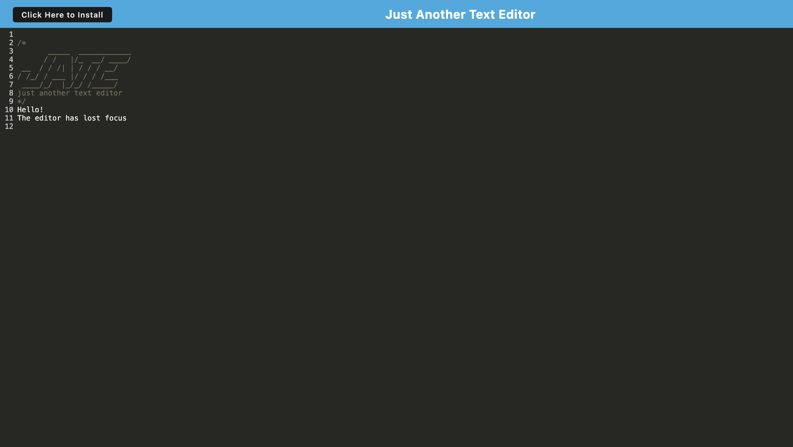

# Progressive Web App Text Editor

## User Story

>AS A developer
>I WANT to create notes or code snippets with or without an internet connection
>SO THAT I can reliably retrieve them for later use

## Acceptance Criteria

>GIVEN a text editor web application
>WHEN I open my application in my editor
>THEN I should see a client server folder structure

>WHEN I run `npm run start` from the root directory
>THEN I find that my application should start up the backend and serve the client

>WHEN I run the text editor application from my terminal
>THEN I find that my JavaScript files have been bundled using webpack

>WHEN I run my webpack plugins
>THEN I find that I have a generated HTML file, service worker, and a manifest file

>WHEN I use next-gen JavaScript in my application
>THEN I find that the text editor still functions in the browser without errors

>WHEN I open the text editor
>THEN I find that IndexedDB has immediately created a database storage

>WHEN I enter content and subsequently click off of the DOM window
>THEN I find that the content in the text editor has been saved with IndexedDB

>WHEN I reopen the text editor after closing it
>THEN I find that the content in the text editor has been retrieved from our IndexedDB

>WHEN I click on the Install button
>THEN I download my web application as an icon on my desktop

>WHEN I load my web application
>THEN I should have a registered service worker using workbox

>WHEN I register a service worker
>THEN I should have my static assets pre cached upon loading along with subsequent pages and static assets

>WHEN I deploy to Render
>THEN I should have proper build scripts for a webpack application

## Installation
- Clone this repository into your local repository
- npm run build
- npm run start
- open localhost:3000

## Usage

This is a simple text editor to explore the use of webpack. 

## Technologies Used

Webpack was the main technology focused on in this project. Others used included:
- Javascript
- Node
- Express
- Nodemon
- Babbel-loader
- Css-loader
- Code-mirror-themes
- Idb

## What I Learned

Webpack is a powerful tool when it comes to creating progressive web apps. I can see how providing an app like experience along with offline functionality creates a more powerful and user friendly site. I feel as though I have just scratched the surface of these technologies and look forward to diving deeper into the nuances of the various npm packages.

## Screenshots

## Demo Video

## Source Code

Source code was taken from U of O bootcamp. Some code snippets were used from U of O bootcamp activities. Thank you to askBCS for their support as well. 

## Author

I am a University of Oregon full stack developer bootcamp student. I am looking to collaborate on any type of coding project to hone my skills and expand my knowledge base. Please check out my other projects on [github](https://github.com/TorySnopl). Lets connect via [LinkedIn](https://www.linkedin.com/in/tory-snopl-70b00a283/).

